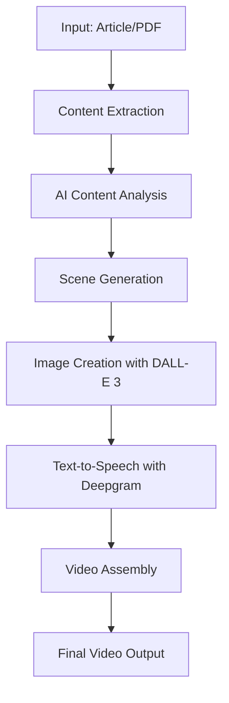

# 🎬 Video Generator Module

> Transform articles and PDFs into engaging YouTube Shorts-style videos using AI

---

## 🚀 Features

- 📰 **Article Processing**: Convert web articles into video content
- 📄 **PDF Support**: Transform PDF documents into engaging videos
- 🎨 **AI-Generated Images**: Create eye-catching visuals with DALL-E 3
- 🎤 **Text-to-Speech**: Generate natural-sounding audio with Deepgram
- 🎬 **Video Generation**: Produce YouTube Shorts-style vertical videos
- 🌐 **REST API**: Easy integration with web applications
- 🔄 **Batch Processing**: Handle multiple PDFs simultaneously

---

## ⚙️ Setup

### 🔑 API Keys Configuration

Set/Export the following API keys:

```bash
export OPENAI_API_KEY="your_openai_api_key"
export DEEPGRAM_API_KEY="your_deepgram_api_key"
```

Or create a `.env` file:

```env
OPENAI_API_KEY=your_openai_api_key
DEEPGRAM_API_KEY=your_deepgram_api_key
```

### 🐍 Environment Setup

1. **Create & Activate Virtual Environment**
   ```bash
   # Create virtual environment
   python -m venv venv
   
   # Activate on Unix/macOS
   source venv/bin/activate
   
   # Activate on Windows
   venv\Scripts\activate
   ```

2. **Install Dependencies**
   ```bash
   pip install -r requirements.txt
   ```

3. **Install Playwright**
   ```bash
   playwright install
   ```

---

## 🎯 Usage

### 📝 Configure Your Input

1. **For Articles**: Open `agent.py` and add your article URL in the `main` method
2. **For PDFs**: Place your PDF files in the project directory

### 🎬 Generate Videos

#### Single PDF Processing
```bash
python agent.py pdf GW.pdf
```

#### Multiple PDFs Processing
```bash
python agent.py pdf GW.pdf AnotherDocument.pdf
```

#### Article URL Processing
```bash
python agent.py url https://www.theverge.com/news/610721/thomson-reuters-ross-intelligence-ai-copyright-infringement
```

---

## 🌐 REST API

### 🚀 Start the Server

**Recommended (Default):**
```bash
python agent.py
```

**Development Mode:**
```bash
uvicorn agent:app --reload
```

### 📡 API Endpoints

#### Process URL
```bash
curl -X POST http://127.0.0.1:8000/process \
  -F "type=url" \
  -F "url=https://www.theverge.com/news/610721/thomson-reuters-ross-intelligence-ai-copyright-infringement"
```

#### Process Single PDF
```bash
curl -X POST http://127.0.0.1:8000/process \
  -F "type=pdf" \
  -F "pdfs=@/path/to/your/file.pdf"
```

#### Process Multiple PDFs
```bash
curl -X POST http://127.0.0.1:8000/process \
  -F "type=pdf" \
  -F "pdfs=@/path/to/file1.pdf" \
  -F "pdfs=@/path/to/file2.pdf" \
  -F "pdfs=@/path/to/file3.pdf"
```

---

## 🔧 How It Works



The system processes your input through several AI-powered stages:

1. **📖 Content Extraction**: Extracts text and key information from articles or PDFs
2. **🧠 AI Analysis**: Uses OpenAI to break down content into engaging scenes
3. **🎨 Visual Generation**: Creates compelling images with DALL-E 3
4. **🎤 Audio Synthesis**: Generates natural speech with Deepgram TTS
5. **🎬 Video Assembly**: Combines all elements into a polished video

---


```sh
OPENAI_API_KEY=your_openai_api_key
DEEPGRAM_API_KEY=your_deepgram_api_key
```

### Setup

1. **Create & Activate a Virtual Environment**
   ```bash
   python -m venv venv
   source venv/bin/activate 

   or 

   venv\Scripts\activate
   ```

- Run the following command inside your virtual environment (venv):

   ```sh
   playwright install
   ```

2. **Add Your Article Link**
   - Open the `agent.py` file.
   - Insert your desired article link in the `main` method.

3. **Run the Script**
   ```bash
   python agent.py
   ```


### To Run the Script

Single PDF:
```sh
python agent.py pdf GW.pdf
```

Multiple PDFs:
```sh
python agent.py pdf GW.pdf AnotherDocument.pdf
```

Using URL:

```sh
python agent.py url https://www.theverge.com/news/610721/thomson-reuters-ross-intelligence-ai-copyright-infringement
```

<!-- Example list of links to news articles: -->
<!-- https://www.bbc.com/future/article/20250122-expert-tips-on-how-to-keep-exercising-during-cold-winter-weather -->


## To start the REST API server:

[Recommended] Default run:
```sh
python agent.py
```

### Testing with cURL  [URL / PDF / Multiple PDFs] 

```sh
curl -X POST http://127.0.0.1:8000/process -F "type=url" -F "url=https://www.theverge.com/news/610721/thomson-reuters-ross-intelligence-ai-copyright-infringement"
```

```sh
curl -X POST http://127.0.0.1:8000/process \
-F "type=pdf" \
-F "pdfs=@/path/to/your/file.pdf"
```

```sh
curl -X POST http://127.0.0.1:8000/process \
-F "type=pdf" \
-F "pdfs=@/path/to/file1.pdf" \
-F "pdfs=@/path/to/file2.pdf" \
-F "pdfs=@/path/to/file3.pdf"
```


<!-- -----------------------------------------------  TESTING -------------------------------------------------->

[optional / For Testing] Start the Flask [Async] server:
```sh
uvicorn agent:app --reload
```

```sh
curl -X POST http://127.0.0.1:8000/process -F "type=url" -F "url=https://www.example.com/article"
```

```sh
curl -X POST http://127.0.0.1:8000/process -F "type=pdf" -F "pdfs=@path/to/your/file1.pdf" -F "pdfs=@path/to/your/file2.pdf"
```